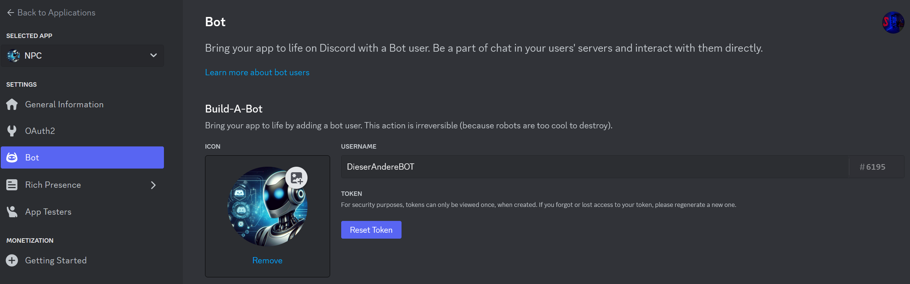
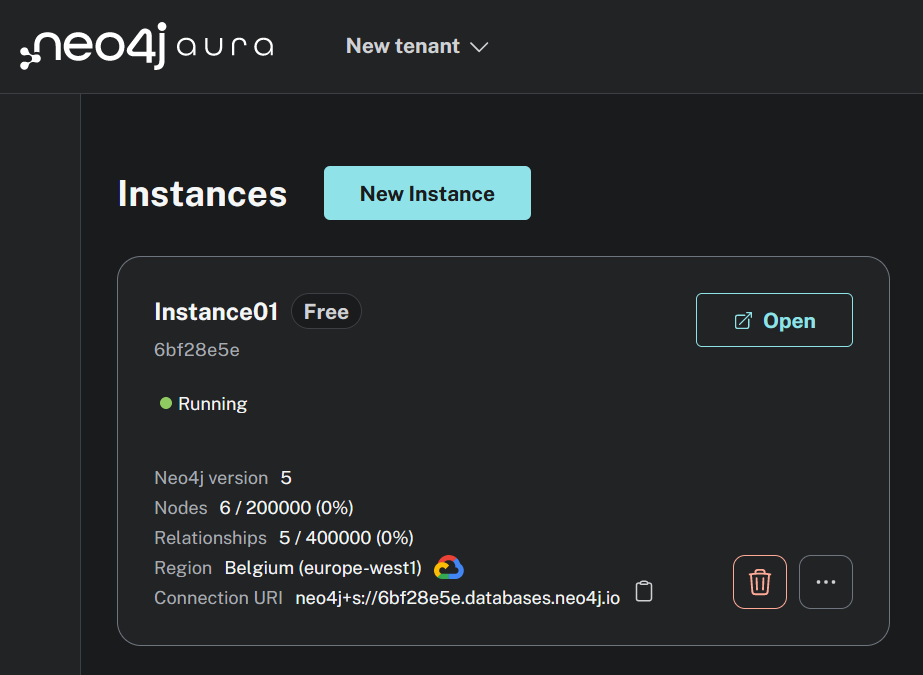

# Discord Bot mit Neo4J

## Dokumentation

### Vorgehen

Wir haben im [Discord Developer Portal](https://discord.com/developers/docs/getting-started) einen Discord Bot erstellt, diesem haben wir einen Namen, sowie ein Profilbild und Berechtigungen gegeben. Danach mussten wir ihn nur noch in unseren Discord-Server einladen.

Nachdem haben wir eine neue Instanz mit [Neo4J Aura](https://console.neo4j.io/) erstellt, damit wir unsere Neo4J Datenbank dort laufen lassen können.

Nachdem haben wir mit dem Python Script begonnen, damit der Bot auch irgendwas machen kann und nicht nur in unserem Discord Server ist, sondern auch etwas machen kann. Dieses Python Script wird immer erweitert, falls noch neue Ideen dazukommen oder andere Anpassungen gemacht werden.

Damit der Bot auch läuft, wenn das Python Script Lokal nicht läuft, sondern einfach immer funktioniert hosten wir ihn gratis auf [Bot-Hosting.net](https://bot-hosting.net/?aff=720339805782671484).
